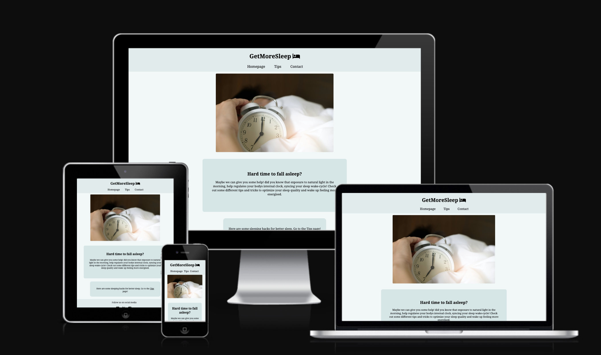

# GetMoreSleep

The website [GetMoreSleep](https://timalexanderandersson.github.io/Get-More-Sleep-Website/) is for people who having a hard time falling a sleep. And in need of some short tips to help people improve the sleeping quality, get more energy, faster recovery and falling asleep faster.

  
  

## Features 

### Header 

-  GetMoreSleep explains directly what the site is all about.
- color used is #0F7881 made more transparent (0.15)
- Website is clear for all ages.

### navigation

- Navigation to homepage, Tips and contact.
- homepage is all the relevant about the webpage.
- tips for all the hacks for sleep
- contact for questions about tips or website
- clearly understand what each of the links navigate to.

### Hard time to fall asleep? part

- trying to solve a problem for people with sleeping problems.
- telling information about hacks people may not know.
- and the box include a link to the tips site.

### Tips part

- This part of the website is what the user is there for to get the information they search for.
- h2 with clear direction.
- bullet symbols with tips for the user to read.
- clear and short information.
  
  ### Contact 

- Contact site give the user a chance to ask about the website or ask about more sleeping hacks.
- a short text about why user the user want to send message.
- firstname ,last name, e-mail and an question is required.

