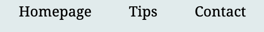

# GetMoreSleep

The website [GetMoreSleep](https://timalexanderandersson.github.io/Get-More-Sleep-Website/) is for people who having a hard time falling a sleep. And in need of some short tips to help people improve the sleeping quality, get more energy, faster recovery and falling asleep faster.

  
  

## Features 

### Header 

-  GetMoreSleep explains directly what the site is all about.
- color used is #0F7881 made more transparent (0.15)
- Website is clear for all ages.

### navigation

- Navigation to homepage, Tips and contact. they have the center position.
- homepage is all the relevant about the webpage.
- tips for all the hacks for sleep.
- contact for questions about tips or website.
- clearly understand what each of the links navigate to.

### Hard time to fall asleep? 

- This is the information part of the first page of the website.
- telling information about hacks they may not know to get users to go to the tips site.
- and the box include a link to the tips site.
- background color #f1f8f8.

### Tips part

- This part of the website is what the user is there for to get the information they search for.
- h2 with clear direction.
- bullet symbols with tips for the user to read.
- clear and short information.
  
  ### Contact 

- Contact site give the user a chance to ask about the website or ask about more sleeping hacks.
- a short text about why the user want to send message.
- firstname ,last name, e-mail and question  part is required.

### Footer

-  bottom of the page is where you find the follow us on social media with icon links to the different webpages.

- instagram link, X/twitter link, Facebook link.

- color used #0F7881 made more transparent (0.15).

## Testing 

- The website is tested and is responsive in Google chrome, Safari and Firefox browser.

- Easy to see and read everything on the webpages.

- Everything works on the webpages. contact page: every name, lastname, e-mail and textarea is required before you can submit.

### Validators / Lighthouse

- **accessibility**: lighthouse show an 93 in accessibility.

- **HTML**: testing with official W3C Validator: one warning was found going through the validator.

solution: Change the h1 to an h2.

- **CSS**: testing with official (jigsaw) validator: no error was found going through the validator.

### Bugs 

- No bugs found.

### Unfixed bugs
 
 - None unfixed
 ## Deployment

 **Deployment was made on github.**
 
 - went to /Get-More-Sleep-Website/settings to /Get-More-Sleep-Website/settings/pages from settings then the link to pages.
 -  then to branch to the drop-down menu select main/none.
 - main selected.
 - deployment complete. and link is accessible.

 ## Credits 

 **Content on the webpage**
 
 - inspiration from love running project with hover effect and footer with social media icons. twitter/X , facebook, and w3schools.
 - https://www.verywellmind.com/sleep-syncing-for-better-sleep-and-energy-7504842 
 https://www.webmd.com/sleep-disorders/features/morning-light-better-sleep
 https://healthnews.com/sleep/sleep-hacks/andrew-hubermans-sleep-routine/
 https://www.calm.com/blog/breathing-exercises-for-sleep
 https://www.verywellhealth.com/eating-before-bed-3014981
 the tips.

 **Media**
- pexels.com for the picture on the first homepage(clock in bed).
- coolors.co for color #0F7881 in header and footer.
- https://favicon.io/ for making my icon to the website.
- https://fontawesome.com/ for icon to the title on the website.